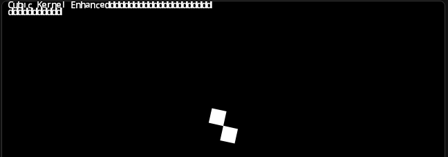

# Cubic Kernel Enhanced
CKE, an enhanced version of Cubic Kernel my boys
# DEPRECATED VERSIONS
1.0-beta1
1.0
1.1
# CKE Features
### This has now:
AutoFS (automatic FS mounter, and home of the FSCK (file system check)),
Drivers Support,
Local Storage,
Comment blocks,
Widescreen (16:9) ,
Infinite clones capacity,
CubeDrv,
LAGPE PORT (tho it's not preinstalled to not be confused with CubeDrv)

# How to use?
### ALEOS FIBER 1.1.2 IS HERE! USE IT AT: https://turbowarp.org/?project_url=cdn.jsdelivr.net/gh/AlRX890/CubicKernel_Enhanced%40main/AleOS%20Fiber1.1.2.sb3&fps=60&interpolate&clones=Infinity&hqpen&size=640x360
### CKE 1.1.2.1, USE IT AT: https://turbowarp.org/?project_url=rawcdn.githack.com/AlRX890/CubicKernel_Enhanced/refs/heads/main/cubic1.1.2.1.sb3&fps=60&interpolate&clones=Infinity&hqpen&size=640x360 (BROKEN)
### CKE 1.1.2.2, USE IT AT: https://turbowarp.org/?project_url=rawcdn.githack.com/AlRX890/CubicKernel_Enhanced/refs/heads/main/cubic1.1.2.2.sb3&fps=60&interpolate&clones=Infinity&hqpen&size=640x360

# Notes
## NOTE 1:
1.1.2.2 will be the LAST version of the 1.1.X and 1.1 line, will be LTS until its support ends, and using versions prior to 1.1.2.2 are NOT ALLOWED ANYMORE, THIS BUG SPANS 1.0-BETA1 TO 1.1.2.1

# REMOVED STUFF
## 1.0-beta 2 10_REBUILD:
My Blocks+ (CST ID) due to CKE 1.0-beta2 breaking on CodeTorch with collab

# 1.1.2.1 changelog
Bug fixes
new kernel.cube sprite
Added turbostation for BIOS Menu, Boot Menu & Stub OS (tho its useless)

# 1.1.2.2 changelog 
Removed FSERROR_SCR
